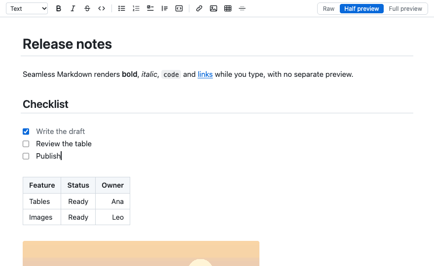
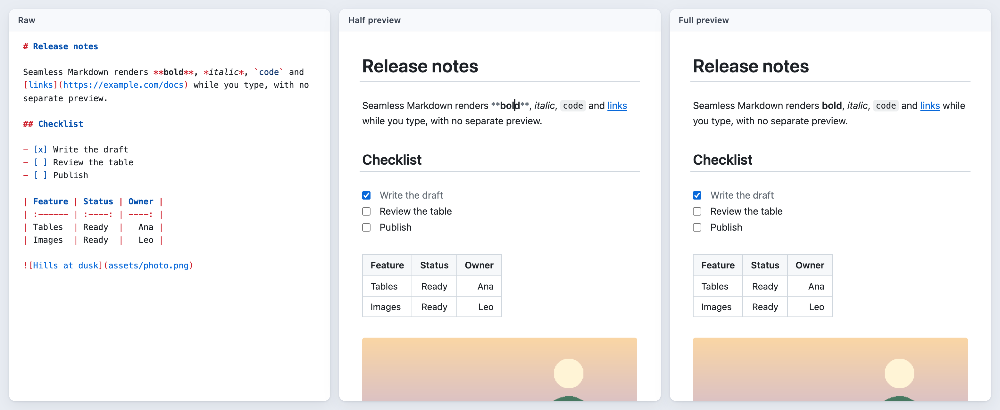
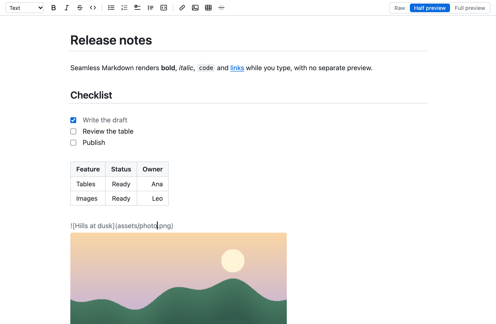
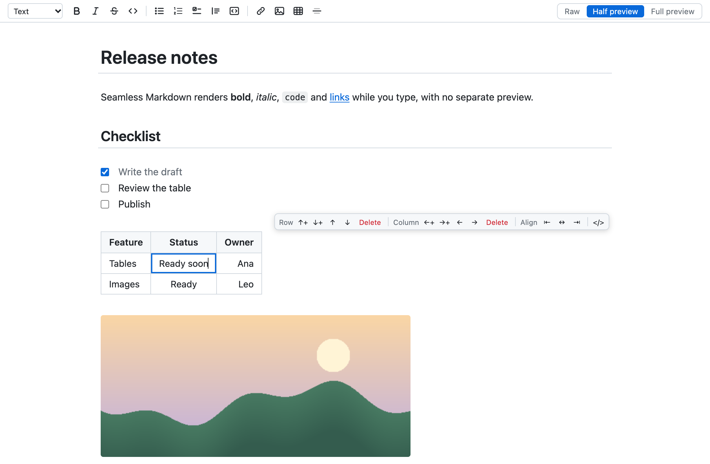
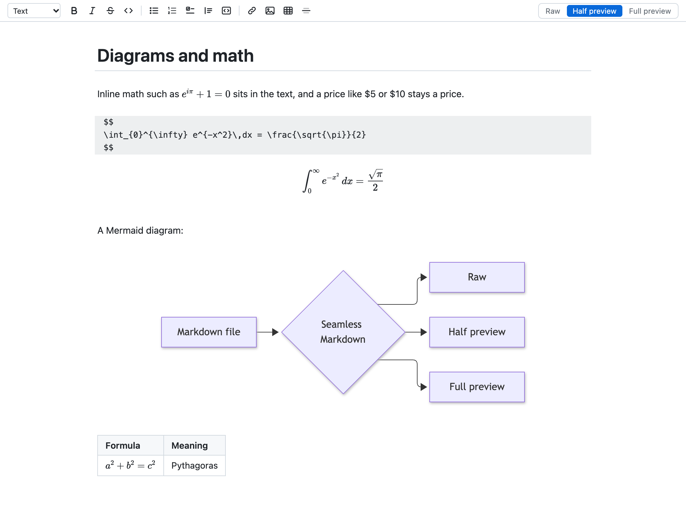
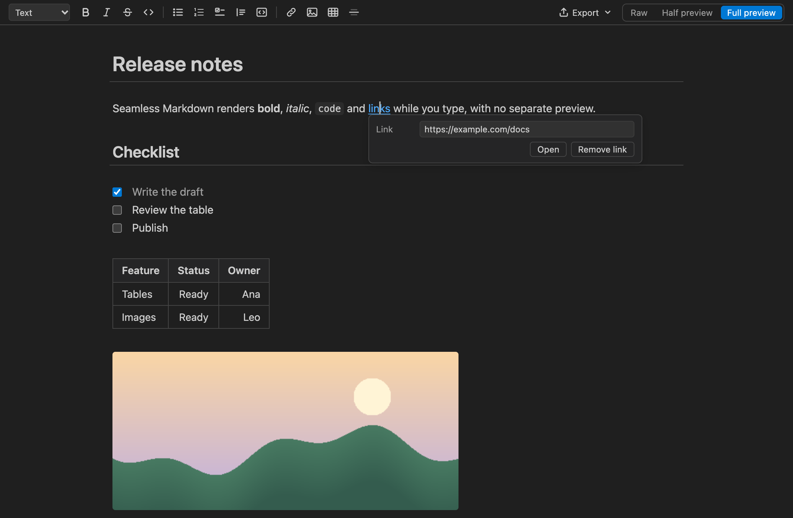

# Seamless Markdown

A Markdown editor for VS Code that removes the need for a separate preview. You edit one document and choose how much of the syntax you want to see.





| Mode | What you see | How you edit |
| :--- | :----------- | :----------- |
| **Raw** | Plain Markdown with syntax colours | Like any text file |
| **Half preview** | The rendered document. The syntax of the element under the cursor appears so you can change it. Images stay visible while you edit their path | Type Markdown, or use the toolbar and shortcuts |
| **Full preview** | The finished document. Syntax stays hidden | Type text; links and images are edited in a small popover, everything else with the toolbar and shortcuts |

Switching modes is instant and keeps your place. The mode is remembered per file.

In half preview, the element under the cursor shows its Markdown. Here the cursor is in the image path, and the image stays visible:



Tables are edited in place, with a bar for rows, columns and alignment:



Math and Mermaid diagrams are drawn in place. Here the cursor is in the formula, so its source shows above the result:



Full preview hides all syntax; links and images are edited in a popover. It follows your colour theme:



The file on disk is always plain Markdown. The editor never rewrites text you did not touch: opening and saving a file leaves it byte for byte the same. The only reformatting it does is to re-align the pipes of a table whose cell you edited (this can be turned off).

## Getting started

1. Install the packaged extension:

   ```bash
   code --install-extension seamless-markdown-0.3.0.vsix
   ```

2. Open a Markdown file, then click the preview icon in the editor title bar, or run **Seamless Markdown: Open with Seamless Markdown** from the Command Palette.
3. To use it for every Markdown file, run **Seamless Markdown: Use as Default Editor for Markdown**. **Seamless Markdown: Stop Using as Default Editor** reverts this.

The extension never becomes the default by itself, and it is not used in diff views.

To try it without installing, run it from this folder:

```bash
code --extensionDevelopmentPath="$PWD" sample
```

## Features

- **Formatting**: bold, italic, strikethrough, inline code, headings, bullet, numbered and task lists, quotes, code blocks, links, rules. By typing Markdown, by shortcut, or from the toolbar.
- **Tables**: rendered as a grid in both preview modes. Click a cell to edit it. `Tab` and `Shift+Tab` move between cells, `Enter` moves down, and both add a row at the end. Arrow keys move in and out of the table. A small bar above the table inserts, deletes, moves and duplicates rows and columns, sorts by a column, sets column alignment, and shows the table's Markdown source. Right-click a cell, or press the bar's `…` button, for the full menu, which also clears a row or column and copies the table as Markdown or TSV.
- **Images**: shown inline, with relative paths resolved from the document. Paste an image from the clipboard or drop one in and it is saved to an `assets` folder next to the document and linked. Dragging a file from the Explorer links it without copying (hold `Shift` while dropping, as VS Code requires). File paths are completed as you type the target of a link or image. Drag the corner of a picture to resize it; since Markdown has no syntax for a size, the image is then written as an `` tag with a `width`.
- **Footnotes**: `[^1]` is shown as a raised number and its `[^1]: text` definition as a small numbered note. `Cmd`/`Ctrl`+click jumps between the two.
- **Math**: `$x^2$` inline and `$$` blocks, drawn with KaTeX. A price such as $5 is left alone.
- **Mermaid diagrams**: a `mermaid` code block is drawn as a diagram. Click a diagram or formula block, or move into it with the arrow keys, to edit its source with the result shown underneath.
- **Slash menu**: type `/` at the start of a line to insert a heading, list, quote, code block, table, image, link, divider or table of contents.
- **Table of contents**: *Insert Table of Contents* (or `/toc`) writes a nested list of links to the headings between `<!-- toc -->` and `<!-- tocstop -->`. It is brought up to date on save, also in the plain text editor, or with *Update Table of Contents*.
- **Smart paste**: pasting a URL over selected text makes a link; pasting cells copied from a spreadsheet makes a table; pasting formatted text from a web page, Google Docs or Word makes Markdown (hold `Shift` while pasting for the plain text).
- **Links**: `Cmd`/`Ctrl`+click opens web links in the browser, relative `.md` links in this editor, and `#heading` links jump within the document.
- **Broken links**: a link or image whose file does not exist, a link to a heading that does not exist (in this or another Markdown file) and a reference link without a definition get a wavy underline with the reason, and are listed in the Problems panel. A mistyped heading has a quick fix. Only local files are looked at; web links are never requested.
- **Task lists** with clickable checkboxes, **GitHub alerts** (`> [!NOTE]`), **code blocks** with syntax colours and a copy button, **front matter** shown as a tidy block.
- **Wiki links and backlinks** (off by default, turn on `seamlessMarkdown.wikiLinks`): `[[Note]]`, `[[Note#Heading]]` and `[[Note|shown text]]` link to other Markdown files of the workspace, with completion after `[[`. `Cmd`/`Ctrl`+click opens the note, or offers to create it next to the document when it does not exist. The link check reports a note or heading that does not exist and a name that fits several notes. Export as HTML turns a wiki link into a link to that note's `.html`. A "Backlinks" panel in the Explorer lists the notes that link to the open one.
- **Outline**: a "Markdown Outline" panel in the Explorer lists the headings; click one to jump to it.
- **Copy as HTML**: copies the selection, or the whole document, as HTML.
- **Export**: **Export as HTML…** writes one self-contained file, with images embedded and math as MathML. **Export as PDF…** opens a print version in your browser for Print → Save as PDF, or creates the PDF directly when Chrome, Edge or Chromium is installed. Nothing is downloaded.
- **Find and replace**, **Go to Heading**, **folding** of the section under a heading (hover a heading and click the arrow in the margin), word count and reading time in the status bar.
- Follows the VS Code colour theme, and works with undo, redo, save, hot exit, split editors and source control exactly like a text file, because it edits the same text document.

## Shortcuts

`Mod` is `Cmd` on macOS and `Ctrl` elsewhere. All of them apply only while this editor has focus and can be changed in Keyboard Shortcuts.

| Action | Shortcut |
| :----- | :------- |
| Switch to the next mode | `Alt+M` |
| Bold / italic | `Mod+B` / `Mod+I` |
| Strikethrough | `Alt+Shift+5` |
| Inline code | `Mod+E` |
| Insert or edit link | `Mod+L` |
| Bullet / numbered list | `Mod+Shift+8` / `Mod+Shift+7` |
| Quote | `Mod+Shift+9` |
| Tick or untick a task | `Alt+C` |
| Heading level up / down | `Ctrl+Shift+]` / `Ctrl+Shift+[` |
| Go to heading | `Mod+Shift+O` |
| Fold / unfold the section at the cursor | `Mod+Alt+[` / `Mod+Alt+]` |
| Find and replace | `Mod+F` |
| Indent / outdent a list item | `Tab` / `Shift+Tab` |
| Move a table row | `Alt+Up` / `Alt+Down` in a cell |
| Delete a table row / column | `Mod+Shift+Backspace` / `Mod+Alt+Backspace` in a cell |
| Duplicate a table row | `Mod+Shift+D` in a cell |
| Add another cursor | `Alt`+click |

`Mod+K` is not used for links because it starts VS Code's two-key shortcuts.

## Settings

| Setting | Default | Meaning |
| :------ | :------ | :------ |
| `seamlessMarkdown.defaultMode` | `half` | Mode for files that have no remembered mode |
| `seamlessMarkdown.rememberModePerFile` | `true` | Reopen each file in the mode it was last used in |
| `seamlessMarkdown.lineWidth` | `860` | Maximum text width in the preview modes, in pixels. `0` uses the full width |
| `seamlessMarkdown.fontSize` | `15` | Font size of the preview modes |
| `seamlessMarkdown.fontFamily` | empty | Font of the preview modes. Empty uses the VS Code interface font |
| `seamlessMarkdown.showToolbar` | `true` | Show the toolbar |
| `seamlessMarkdown.imageFolder` | `assets` | Where pasted and dropped images are saved, relative to the document. `${fileBasenameNoExtension}` is replaced by the document name |
| `seamlessMarkdown.tableAutoAlign` | `true` | Re-align a table's pipes when one of its cells is edited |
| `seamlessMarkdown.checkLinks` | `true` | Underline broken links and list them in the Problems panel |
| `seamlessMarkdown.pasteRichText` | `true` | Paste formatted text (from a web page, Google Docs, Word) as Markdown |
| `seamlessMarkdown.customCss` | empty | Extra CSS rules for the editor |
| `seamlessMarkdown.export.embedImages` | `true` | Embed local images in exported HTML. When off, images keep their relative paths |
| `seamlessMarkdown.export.mermaidFromCdn` | `false` | Draw Mermaid diagrams in exported files by loading Mermaid from a CDN. When off, a diagram is exported as its source |
| `seamlessMarkdown.export.browserPath` | empty | Chrome, Edge or Chromium executable for **Create PDF now**. Empty looks in the usual places |
| `seamlessMarkdown.spellCheck` | `false` | Turn on the built-in spell checking for the text and table cells |
| `seamlessMarkdown.toc.updateOnSave` | `true` | Update the table of contents when a file that has the markers is saved |
| `seamlessMarkdown.toc.levels` | `1..6` | Heading levels the table of contents lists, such as `2..4` |
| `seamlessMarkdown.toc.ordered` | `false` | Numbered list instead of bullets |
| `seamlessMarkdown.wikiLinks` | `false` | Treat `[[Note]]` as a link to another Markdown file, and show the Backlinks panel |
| `seamlessMarkdown.promptToSetDefault` | `true` | Ask once whether to become the default Markdown editor |

## Known limitations

- VS Code does not offer its own Outline view, breadcrumb symbols or find widget to custom editors. Use the Markdown Outline panel, **Go to Heading** and the editor's find panel instead.
- HTML is shown as source. `` tags get an image preview next to them; a tag that is only an image is shown as the picture, like a Markdown image.
- Diagrams other than Mermaid (Graphviz, ECharts and so on) are not drawn.
- There is no side-by-side split view. The point of the editor is that you do not need one.
- Tables that are indented or sit inside a list or quote are shown as source.
- In full preview, an empty code block cannot be entered with the arrow keys; use the toolbar button, which puts the cursor inside.
- Typing is sent to VS Code in short bursts so that one burst is one undo step. If you have both `files.autoSave` with a delay and `files.trimTrailingWhitespace` on, a trailing space can be trimmed while you pause in the middle of a sentence, because VS Code cannot see the cursor of a custom editor.
- Very large documents (several thousand lines) are slower to type in for the first few seconds after opening, while the document is still being parsed.

## Development

```bash
npm install
npm run build              # bundles into dist/
npm test                   # unit tests
npm run test:integration   # runs the editor inside a real VS Code
npm run package            # produces the .vsix
npm run screenshots        # regenerates the icon and README images
npm run demo-gif           # regenerates the animated demo
```

`npm run harness` serves the project on port 5173. `http://localhost:5173/harness/index.html?doc=features.md&mode=half&theme=dark` runs the editor in a plain browser against a stand-in for the extension host, which is the quickest way to work on rendering.

How it is put together:

- `src/extension` is the extension host side: a `CustomTextEditorProvider`, document sync, image and link handling, commands.
- `src/webview` is the editor: CodeMirror 6 with the Lezer Markdown parser. The three modes are three levels of decoration over the same text, so nothing is ever converted to another format and back.
- `src/shared` holds the message protocol between the two.

### Releasing

`main` is protected: changes go in through a pull request, and the CI check has to pass.

1. On a branch, bump the version and describe it in `CHANGELOG.md` under a `## x.y.z` heading:

   ```bash
   npm version patch --no-git-tag-version
   ```

2. Open a pull request and merge it once CI is green.
3. On an up-to-date `main`, create and push the tag:

   ```bash
   npm run release:tag
   ```

The tag starts the Release workflow. It runs the tests again, builds the `.vsix`, creates a GitHub release with the `.vsix` attached and that version's changelog as notes, and publishes to the Marketplace if the repository has a `VSCE_PAT` secret and to [Open VSX](https://open-vsx.org) if it has an `OVSX_PAT` secret. A registry without its secret is skipped with a notice, and `npx vsce publish --no-dependencies` or `npx ovsx publish <file>.vsix -p <token>` publishes by hand. The two registries are independent: if one publish fails, the other still runs and the workflow ends as failed.

To publish a tag again, for example after adding a secret that was missing, run the workflow by hand with the tag:

```bash
gh workflow run release.yml -f tag=v0.2.0
```

Running it again is safe. An existing GitHub release gets the `.vsix` uploaded over its asset, and a registry that already has that version is skipped with a notice. A manual run uses the workflow file from `main` and the code from the tag.

#### Open VSX, one time

Open VSX is the registry used by Cursor, VSCodium, Windsurf and other editors built on VS Code. Before the first publish the repository owner has to do this once, following [Publishing Extensions](https://github.com/eclipse-openvsx/openvsx/wiki/Publishing-Extensions) in the Open VSX wiki:

1. Create an Eclipse account at <https://accounts.eclipse.org/user/register> and fill in its **GitHub Username** field with the GitHub account you will use on open-vsx.org.
2. Log in to <https://open-vsx.org> with that GitHub account.
3. In [Settings, Profile](https://open-vsx.org/user-settings/profile), click **Log in with Eclipse**, then **Show Publisher Agreement**, read it and click **Agree**.
4. In [Settings, Access Tokens](https://open-vsx.org/user-settings/tokens), generate a token and copy it. It is shown only once.
5. Create the namespace, which is the `publisher` in `package.json`. A publish fails until the namespace exists:

   ```bash
   npx ovsx create-namespace pepenotti -p <token>
   ```

6. Store the token as a repository secret. The command asks for the value, so it stays out of the shell history:

   ```bash
   gh secret set OVSX_PAT --repo pepenotti/markdown-live-editor
   ```

Creating the namespace does not make you its verified owner. To have the extension shown as verified, claim the namespace as described in [Namespace Access](https://github.com/eclipse-openvsx/openvsx/wiki/Namespace-Access).

### Checks that still need a person

The automated tests cover document sync, undo and redo, CRLF files, split editors, CSP, image saving and link handling inside a real VS Code. These need a human at the keyboard:

- `Mod+B` formats text and does not toggle the side bar; `Mod+S` saves; `Mod+Z` undoes one burst of typing.
- Pasting an image from the clipboard and dropping one from the desktop with `Shift` held.
- The look of the editor in your own colour theme.

## Credits

Built on [CodeMirror 6](https://codemirror.net/) and [Lezer](https://lezer.codemirror.net/), both MIT licensed. See `THIRD-PARTY-NOTICES.md`.
