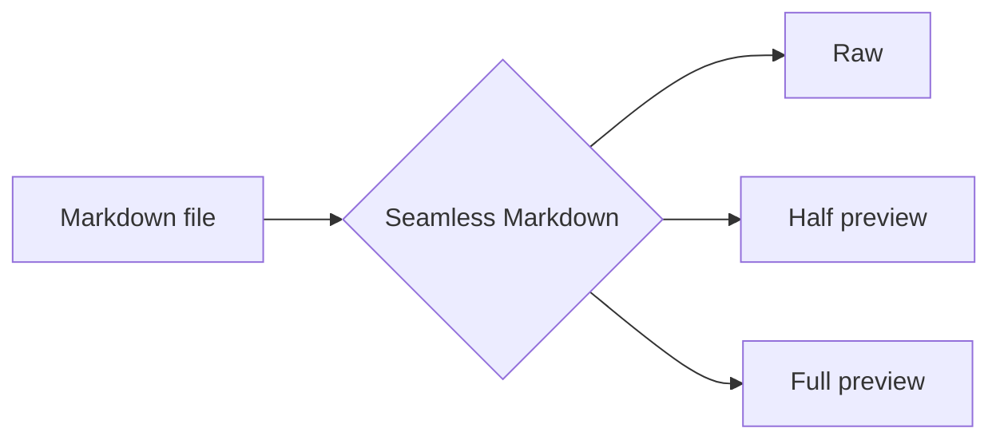

# Diagrams and math

Inline math such as $e^{i\pi} + 1 = 0$ sits in the text, and a price like $5 or $10 stays a price.

$$
\int_{0}^{\infty} e^{-x^2}\,dx = \frac{\sqrt{\pi}}{2}
$$

A Mermaid diagram:

| Formula | Meaning |
| :------ | :------ |
| $a^2 + b^2 = c^2$ | Pythagoras |
