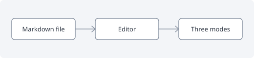

# Seamless Markdown

This file shows everything the editor renders. Switch between **Raw**, **Half preview** and **Full preview** with the buttons on the right or `Alt+M`.

## Inline formatting

Plain text with **bold**, *italic*, ***both***, ~~strikethrough~~ and `inline code`. An escaped \*star\* stays literal.

A [link to the docs](https://example.com/docs "Docs"), a reference link to [the spec][spec], an autolink <https://example.com> and a bare one: https://example.com/bare.

## Images

A local image with a relative path:



Text before  and text after it.


## Lists

- First item
- Second item with enough text to wrap around onto a second line in a normal window, so that the hanging indent can be checked by eye
  - Nested item
  - Another nested item
- Third item

1. One
2. Two
10. Ten

- [ ] An open task
- [x] A finished task
- [ ] Another open task with `code`

## Quotes

> A block quote with **bold** text.
> It continues on a second line.
>
> > A nested quote.

> [!NOTE]
> Useful information the reader should know.

> [!WARNING]
> Something that needs care.

## Code

```js
// A fenced block with a language
function greet(name) {
  return `Hello, ${name}!`;
}
```

    An indented code block

## Tables

| Feature | Raw | Half preview | Full preview |
| :------ | :-: | :----------: | -----------: |
| Markers | shown | on the cursor line | hidden |
| Tables  | pipes | **grid** | grid |
| Images  | path | image + path | image |

Text right after the table.

## Rules and HTML

---

Inline HTML such as <kbd>Ctrl</kbd> is left as it is. An HTML image: 

Setext heading
--------------

Final paragraph. #anchors work too: see [Tables](#tables).

[spec]: https://spec.commonmark.org/
